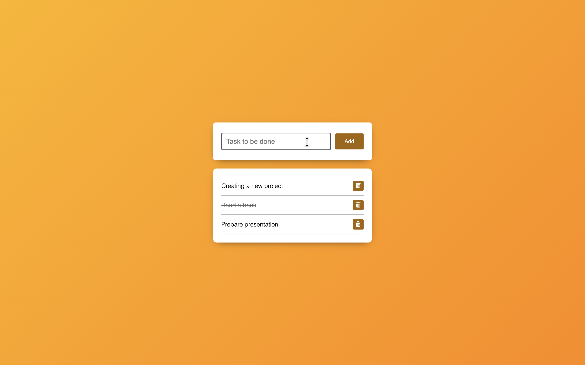

# 📝 To-Do List App

A simple and interactive To-Do List web application built using **HTML**, **CSS**, and **JavaScript**.

---

## 🚀 Features

- ➕ Add new tasks
- ❌ Remove tasks
- ⌨️ Add tasks by pressing **Enter**
- 🧠 Clean and simple UI
- ⚡ Instant DOM updates

---

## 🛠️ Technologies Used

- HTML5
- CSS3
- JavaScript (DOM Manipulation)

---

## 📸 Preview

---

## 🌐 Live Demo

🔗 [Click here to try the app](https://a7med1084.github.io/To-Do-List/)

---

## ⚙️ How It Works

- The app uses `cloneNode()` to duplicate a task template.
- When the user enters text and clicks **Add** (or presses Enter), a new task is created.
- Each task has a delete button to remove it instantly.

---

## 🧪 How to Use

1. Open the project in your browser  
2. Type your task in the input field  
3. Click **Add** or press **Enter**  
4. Click the 🗑️ icon to remove a task  

---

## 👨‍💻 Author

- Ahmed Anwar  

---

⭐ If you like this project, give it a star!
